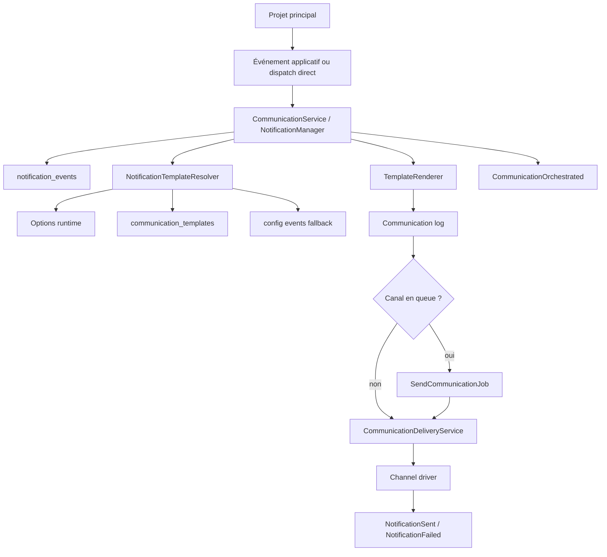
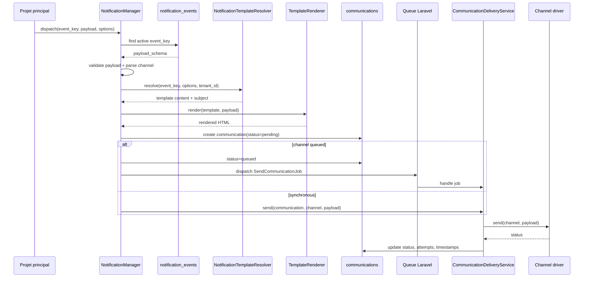
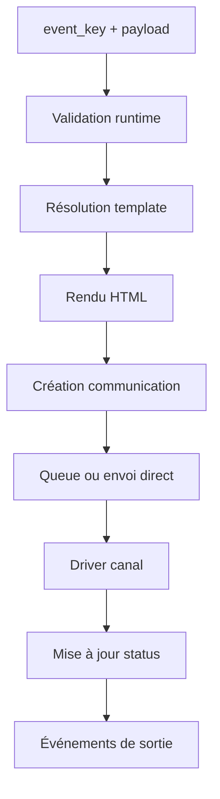
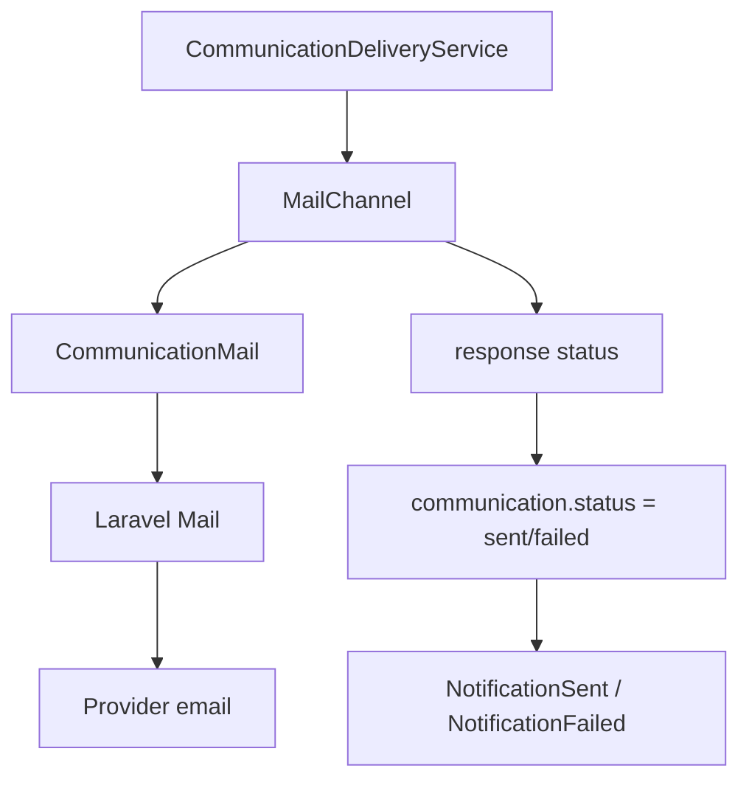
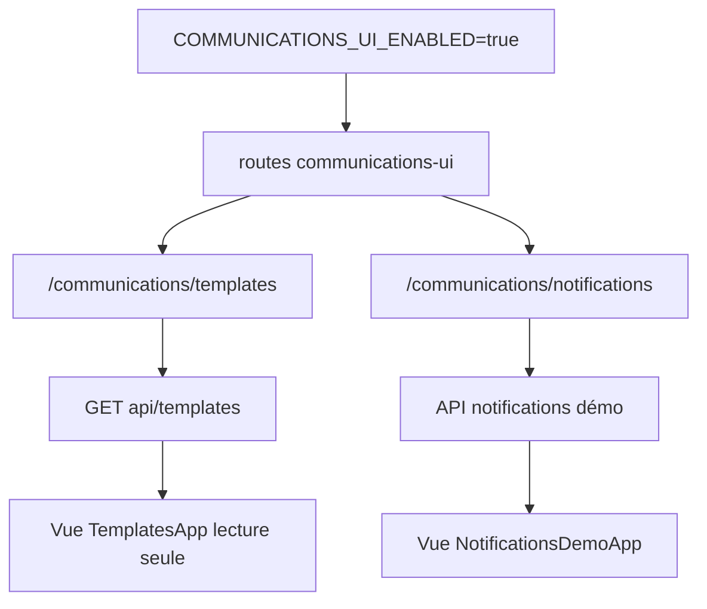
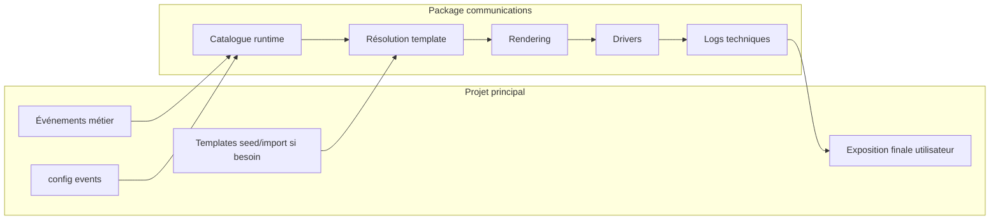
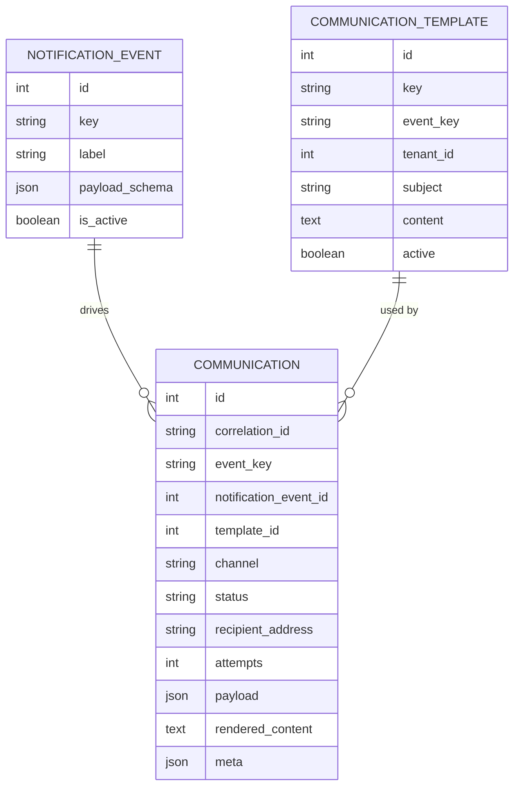

# Diagrammes - ACL Communications

Ce document décrit le flux actuel du package `acl/notification-manager`.

## 1. Vue D'ensemble

## 2. Séquence De Traitement

## 3. Pipeline Interne

## 4. Canal Mail

## 5. UI Optionnelle

## 6. Séparation Des Responsabilités

## 7. Modèle De Données Simplifié

