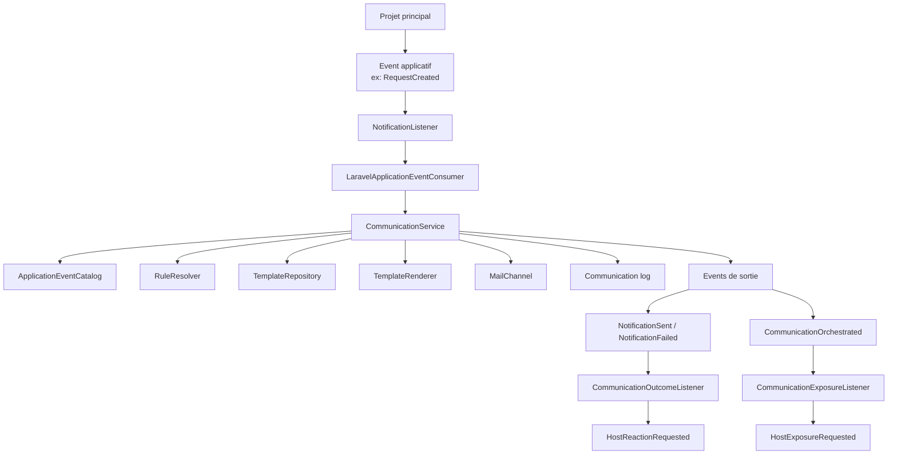
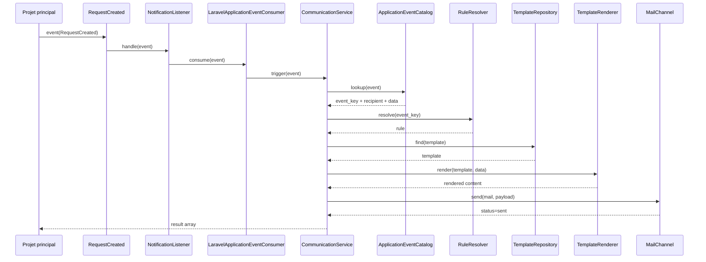
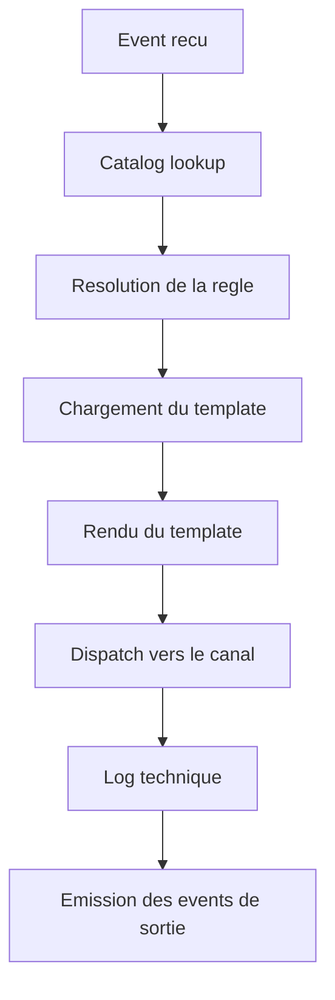
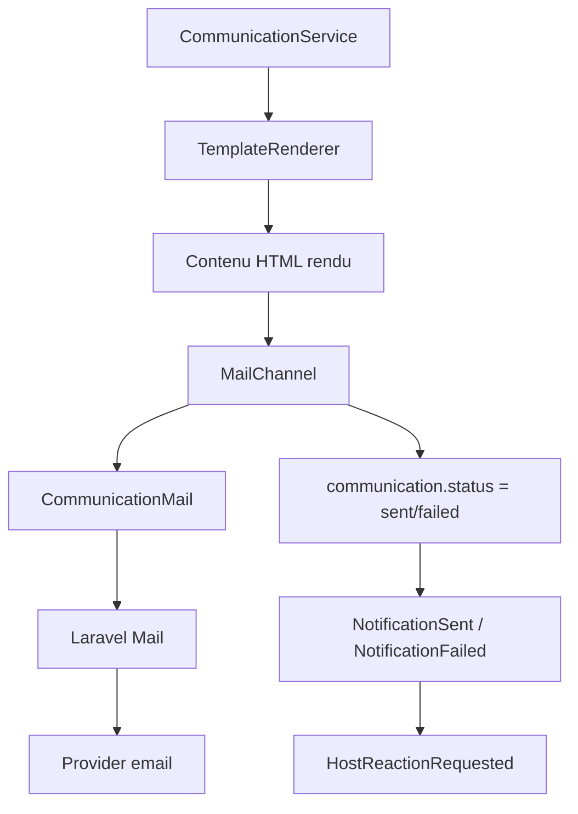
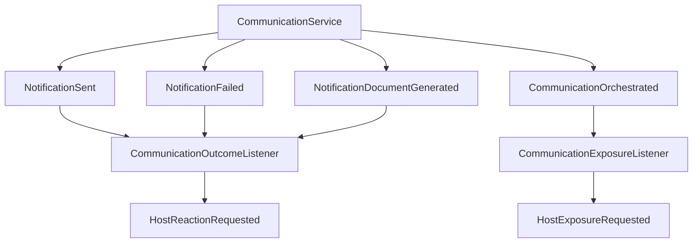
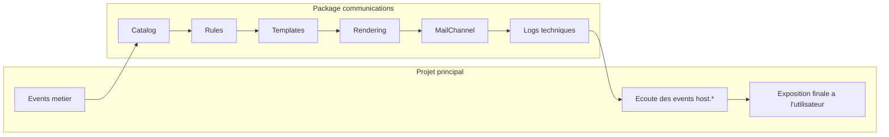
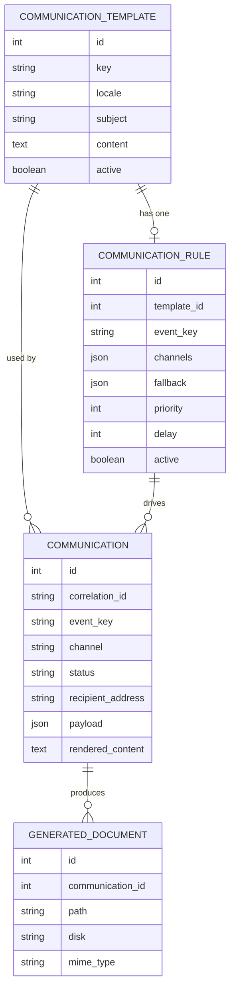

# Diagrammes - ACL Communications

Ce document regroupe les principaux diagrammes Mermaid de l'application/package `notifications`.

## 1. Vue d'ensemble

## 2. Sequence de traitement d'un event entrant

## 3. Pipeline interne du package

## 4. Canal mail

## 5. Evenements de sortie du package

## 6. Separation des responsabilites

## 7. Modele de donnees simplifie

